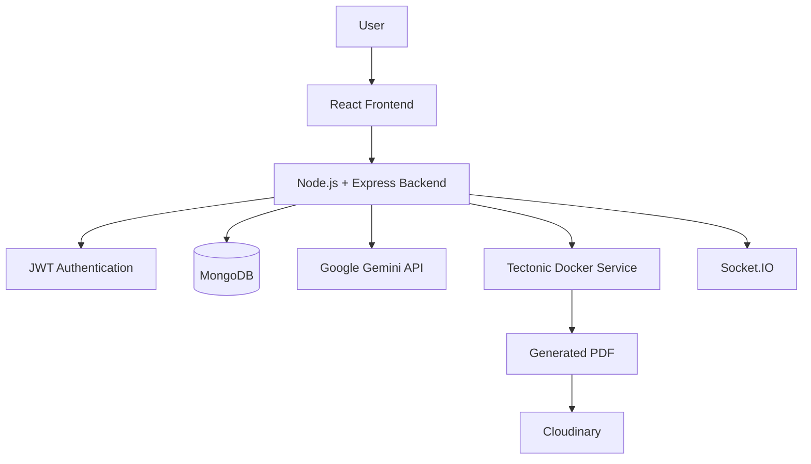
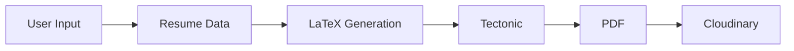

# Resume Forge

> An AI-powered web application for creating professional resumes using structured information, LaTeX, and automated PDF generation.

## Live Demo

**[Try Resume Forge](https://resume-generator-three-alpha.vercel.app/)**

##  Overview

**Resume Forge** is a resume-generation platform built as part of the **GenForge – Generative AI Mini Challenge**.

The project addresses the problem of creating professional resumes without requiring users to manually handle document formatting or LaTeX.

Resume Forge combines:

* A simple **manual resume builder**
* A **LaTeX editor**
* **Generative AI integration using Google Gemini**
* Automated **LaTeX → PDF compilation**
* Resume **version history**
* User authentication and resume ownership

The main idea is to combine the simplicity of a traditional resume builder with the flexibility of LaTeX-based document generation.

---

##  Problem Statement

Creating a professional resume can be difficult because users need to:

* Organize information correctly
* Maintain consistent formatting
* Keep the resume visually professional
* Update the resume for different opportunities
* Deal with document formatting and PDF generation

The challenge requirement was to build an **AI Resume Generator** that generates a professional resume from user-provided information such as work history, skills, education, and achievements.

Resume Forge addresses this by allowing users to enter their information in a structured format and converting that information into a professionally formatted LaTeX document.

---

##  My Approach

Resume Forge provides two ways to work with a resume.

### 1. Manual Resume Builder

Users enter information through individual sections:

* Personal Information
* Education
* Experience
* Projects
* Technical Skills
* Achievements
* Other resume sections

The application converts the structured information into LaTeX.

```text
User Input
    ↓
Structured Resume Data
    ↓
LaTeX
    ↓
Tectonic
    ↓
PDF Resume
```

### 2. LaTeX Editor

Users can directly view and modify the generated LaTeX code.

```text
LaTeX Code
    ↓
Tectonic
    ↓
PDF Resume
```

This gives users both **simplicity** and **technical control**.

---

##  Generative AI Integration

Google Gemini API is integrated into Resume Forge as the project's **generative AI component**.

The AI layer allows the application to use generative AI capabilities while the rest of the system handles resume management, LaTeX generation, compilation, storage, and authentication.

```text
User
 ↓
Resume Information
 ↓
Gemini AI
 ↓
Generated / AI-assisted Content
 ↓
Resume Generation
 ↓
LaTeX
 ↓
PDF
```

The Gemini API is configured through the backend using environment variables so that the API credentials remain server-side.

> The exact AI prompts and functionality are implemented within the application and should not require exposing the Gemini API key to the frontend.

---

##  Features

* 🔐 JWT-based authentication
* 📝 Manual resume builder
* 🤖 Google Gemini API integration
* 🧑‍💻 LaTeX editor
* 📄 PDF resume generation
* 🕒 Resume version history
* ☁️ Cloudinary PDF storage
* ⚡ Socket.IO real-time updates
* 🐳 Dockerized Tectonic compilation
* ⚡ SHA-256 based compilation reuse

---

##  System Architecture



### Component Responsibilities

| Component         | Responsibility                |
| ----------------- | ----------------------------- |
| React,Vanilla CSS            | Frontend user interface       |
| Node.js / Express | Backend and application logic |
| MongoDB           | Resume and user data          |
| JWT               | Authentication                |
| bcrypt            | Password security             |
| Gemini API        | Generative AI functionality   |
| Tectonic          | LaTeX compilation             |
| Docker            | Isolated Tectonic environment |
| Cloudinary        | PDF storage                   |
| Socket.IO         | Real-time communication       |

---

##  Resume Generation Workflow



### Process

1. User enters resume information.
2. Resume data is processed by the application.
3. LaTeX source is generated.
4. The LaTeX source is sent to Tectonic.
5. Tectonic compiles the source into a PDF.
6. The generated PDF is stored using Cloudinary.
7. The PDF is made available to the user.

---

##  Authentication & Version History

Resume Forge uses **JWT authentication**.

After authentication, users can manage their own resumes.

```text
User
 ↓
Login / Register
 ↓
JWT Token
 ↓
Authenticated Request
 ↓
User's Resumes
 ↓
Resume Versions
```

Resume versions allow users to preserve previous states of their resume instead of losing older content after editing.

---

##  Tectonic & Docker

**Tectonic** is the LaTeX compiler used to convert `.tex` documents into PDF files.

It is **not an npm package**.

Resume Forge runs Tectonic inside Docker so that the LaTeX compilation environment can be isolated and reproduced consistently.

```text
Backend
   ↓
Docker Container
   ↓
Tectonic
   ↓
PDF
```

### Build the Docker Image

Navigate to the directory containing the Tectonic Dockerfile:

```bash
cd <TECTONIC_DIRECTORY>
```

Build:

```bash
docker build -t <TECTONIC_IMAGE_NAME> .
```

Run:

```bash
docker run -p 5000:5000 <TECTONIC_IMAGE_NAME>
```

The Tectonic service uses **port 5000**.

The backend communicates with this service when a LaTeX document needs to be compiled.

---

##  CompilationReuse

Resume Forge uses **SHA-256 hashing** to identify identical LaTeX source.

```text
LaTeX Source
     ↓
SHA-256 Hash
     ↓
Check Existing Compilation
     ↓
 ┌───────────────┐
 │               │
 Yes             No
 │               │
Reuse PDF       Compile
                 ↓
                PDF
```

This avoids unnecessarily compiling the same LaTeX source multiple times.

---

#  Local Setup

## Prerequisites

Install:

* Git
* Node.js
* npm
* Docker Desktop / Docker Engine
* MongoDB connection
* Required API/service accounts used by the application

---

## 1. Clone Repository

```bash
git clone <REPOSITORY_URL>
cd <PROJECT_DIRECTORY>
```

---

## 2. Frontend Setup

```bash
cd frontend
npm install
npm run dev
```

Open the frontend using the URL shown by the development server.

---

## 3. Backend Setup

Open another terminal:

```bash
cd backend
npm install
```

Create:

```text
backend/.env
```

Add:

```env
PORT=5000

MONGODB_URI=<YOUR_MONGODB_URI>

JWT_SECRET=<YOUR_JWT_SECRET>
JWT_EXPIRES_IN=15m

GEMINI_API_KEY=<YOUR_GEMINI_API_KEY>
GEMINI_MODEL=<YOUR_GEMINI_MODEL>

CLOUDINARY_CLOUD_NAME=<YOUR_CLOUDINARY_CLOUD_NAME>
CLOUDINARY_API_KEY=<YOUR_CLOUDINARY_API_KEY>
CLOUDINARY_API_SECRET=<YOUR_CLOUDINARY_API_SECRET>

FRONTEND_URL=<YOUR_FRONTEND_URL>
```

Start the backend using the development/start script defined in `backend/package.json`.

---

## 4. Frontend Environment Variables

Create:

```text
frontend/.env
```

Add:

```env
VITE_API_URL=/api
VITE_SOCKET_URL=<YOUR_SOCKET_URL>
```

Because these variables use the `VITE_` prefix, they are exposed to the frontend.

**Never put private API keys or secrets in frontend environment variables.**

---

## 5. Start Tectonic

Build the Docker image:

```bash
docker build -t <TECTONIC_IMAGE_NAME> .
```

Run it:

```bash
docker run -p 5000:5000 <TECTONIC_IMAGE_NAME>
```

---

##  Recommended Startup Order

```text
1. Start Docker / Tectonic
          ↓
2. Start Backend
          ↓
3. Start Frontend
          ↓
4. Open Application
```
---

#  Deployment

Resume Forge uses:

* **Frontend:** Vercel
* **Backend:** Render
* **LaTeX Compilation:** Docker + Tectonic

Production environment variables must be configured directly in the respective deployment platforms.


---

## 🔑 Environment Variables

| Variable                | Purpose                              |
| ----------------------- | ------------------------------------ |
| `PORT`                  | Backend server port                  |
| `MONGODB_URI`           | MongoDB connection                   |
| `JWT_SECRET`            | JWT signing secret                   |
| `JWT_EXPIRES_IN`        | JWT expiration time                  |
| `GEMINI_API_KEY`        | Google Gemini API authentication     |
| `GEMINI_MODEL`          | Gemini model used by the application |
| `CLOUDINARY_CLOUD_NAME` | Cloudinary cloud                     |
| `CLOUDINARY_API_KEY`    | Cloudinary API authentication        |
| `CLOUDINARY_API_SECRET` | Cloudinary API secret                |
| `FRONTEND_URL`          | Frontend application URL             |
| `VITE_API_URL`          | Frontend API URL                     |
| `VITE_SOCKET_URL`       | Socket.IO connection URL             |


---

#  Future Improvements

* More resume templates
* Improved LaTeX customization
* More AI-powered resume assistance
* ATS optimization
* Background PDF compilation
* Enhanced collaboration features

---


```
